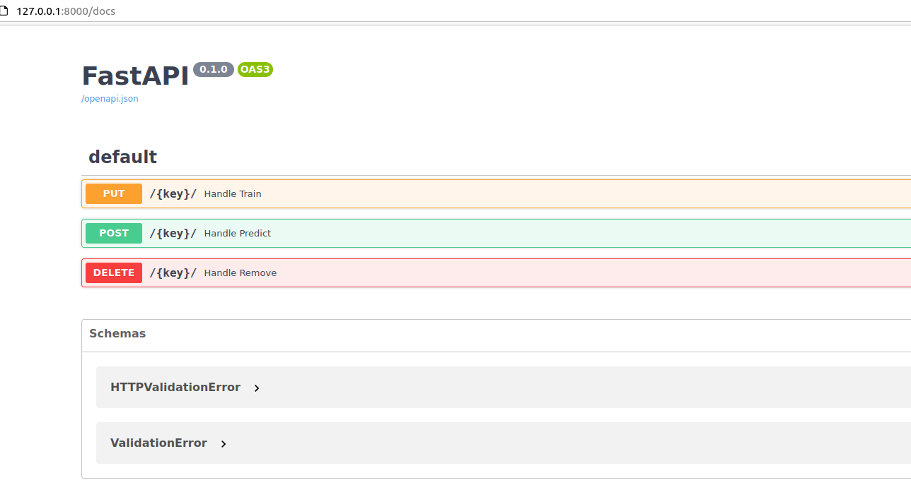
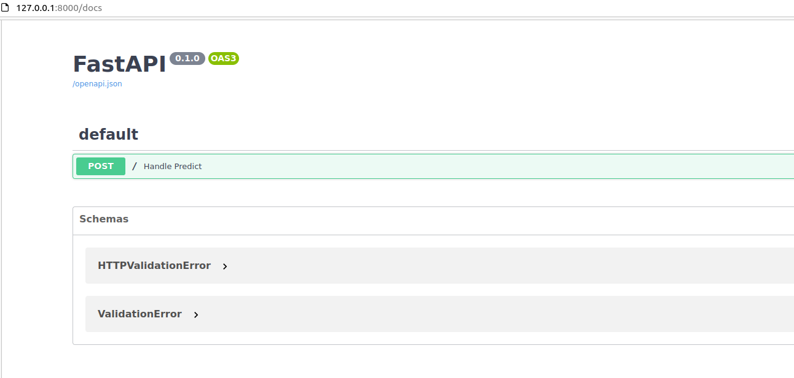

# ml2service

Run your python ML models in a service with tracing and monitoring, without writing the code of the service.

## usage

### fastapi example

Assume that our ML models are completely ready for use. Our models module is
here [examples/myproject/models.py](src/examples/myproject/models.py).

* run dynamic models (each model can be trained by provided input)
  ```
  $ ml2service \
      examples.myproject.models:FooDynamicModelTrainer \
      run \
      dynamic \
      http

  ...
  INFO:     Uvicorn running on http://127.0.0.1:8000 (Press CTRL+C to quit)
  ```
  
* run static model (one model will be trained at the start)
  ```
  $ ml2service \
      examples.myproject.models:FooStaticModelTrainer \
      run \
      static examples/myproject/data.json \
      http
  
  ...
  INFO:     Uvicorn running on http://127.0.0.1:8000 (Press CTRL+C to quit)
  ```
  

## installation

Choose an appropriate extra according to the type of the service you want to run (see extra below).

* with pip
  ```
  pip install ml2service[{extra}]
  ```
* with poetry
  ```
  poetry add ml2service -E {extra}
  ```

### extra

#### fastapi-uvicorn

Run ML models as HTTP service using fastapi & uvicorn

After the service is started, you may find and try all the handlers at `/docs` path.

#### aio-pika

*will be supported in the future*

## development

upcoming feature list

* [ ] add tracing and monitoring (integration with opentelemetry & prometheus)
* [ ] add persistent storages for dynamic models (redis / postgresql / postgresql)
* [ ] support AMQP protocol (run ML with AMQP consumers)
* [ ] dockerfile autogen (?)
